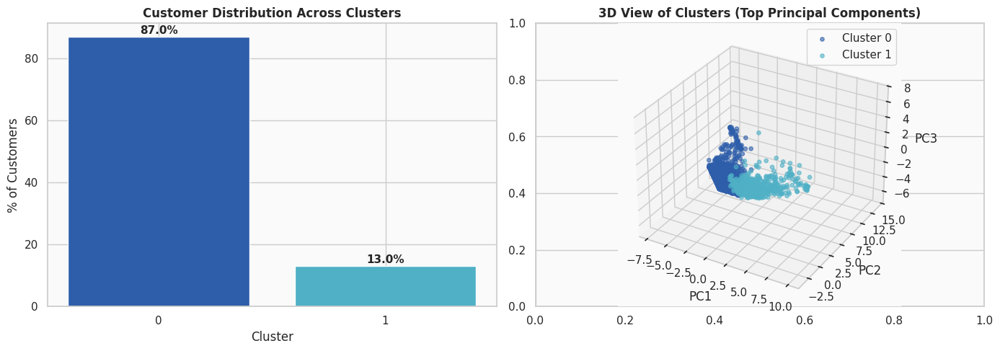
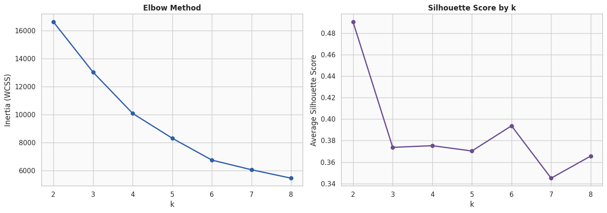
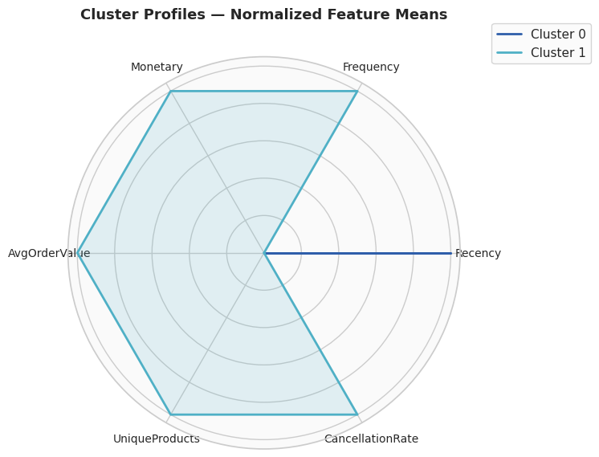
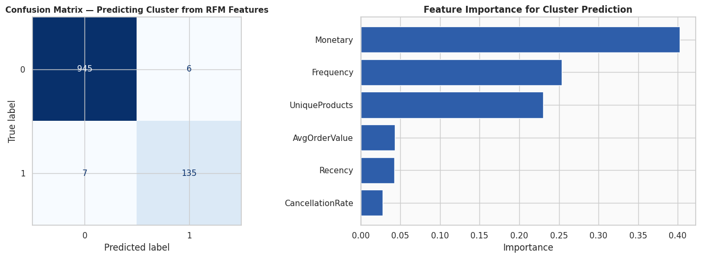

# Customer Segmentation and Recommendation System

Segmenting 4,300+ e-commerce customers by purchasing behavior using RFM analysis and K-Means, then using those segments to power a hybrid product recommendation engine.



## Why this project

Most online retailers treat every customer the same in their marketing — same emails, same offers, same timing. That's a missed opportunity: a customer who orders weekly and one who bought once six months ago don't respond to the same campaign. This project works through that problem end to end on a real UK-based online retailer's transaction log (541,909 records, Dec 2010–Dec 2011): clean the data, engineer behavioral features, cluster customers into meaningful segments, validate that the segments actually hold up statistically, and then use them to recommend products.

## Pipeline

**Data cleaning.** Raw transactions had missing customer IDs, duplicate rows, and cancelled orders mixed in with real purchases. After removing unusable records (~26% of rows — mostly missing `CustomerID`, which can't be attributed to anyone), cancellations were kept and flagged rather than dropped, since cancellation behavior is itself informative about a customer.

**RFM feature engineering.** Every customer got reduced to a feature vector: recency (days since last order), frequency (distinct orders), monetary value (total and average spend), product variety, and cancellation rate. This turned ~400K line-item transactions into 4,371 customer profiles.

**PCA + K-Means.** Standardized the features, ran PCA to deal with multicollinearity (total spend and average order value are obviously correlated), then tested cluster counts from 2–8 using both the elbow method and silhouette scores rather than trusting either alone.



Both methods converged on **k = 2**, with a silhouette score of **0.49** — a solid separation for real-world behavioral data, which is rarely as clean as textbook examples.

**Cluster profiling.** Radar chart makes the two segments legible at a glance:



- **Cluster 0 — Occasional shoppers (~87% of customers):** average recency of 103 days, ~3 orders, ~$794 total spend. Infrequent, lower-commitment buyers.
- **Cluster 1 — High-value regulars (~13% of customers):** average recency of just 20 days, ~16 orders, ~$6,233 total spend, and over 4x the product variety of Cluster 0. Small group, disproportionate value — the kind of segment that justifies a loyalty program on its own.

**Validating the clusters.** Unsupervised clustering has no ground truth to check against, so as a sanity check I trained a Random Forest to predict cluster membership from the same features. If the clusters were arbitrary, the classifier would struggle — instead it hit **99% accuracy**, meaning the two groups are genuinely, not just numerically, distinct.



**Recommendation system.** Built two independent recommenders and combined them:
- *Collaborative filtering* — item-item cosine similarity over a customer-product purchase matrix, i.e. "customers who bought this also bought that."
- *Content-based filtering* — TF-IDF over product descriptions, useful when a product is too new or sparse for collaborative signals to catch.
- A weighted hybrid blends both into a single ranked list per customer.

## Results

| Metric | Value |
|---|---|
| Transactions analyzed | 541,909 |
| Customers after cleaning | 4,371 |
| Optimal clusters (silhouette-validated) | 2 |
| Silhouette score | 0.49 |
| Cluster-prediction classifier accuracy | 99% |

## Tech stack

Python · Pandas · NumPy · Scikit-learn · Matplotlib · Seaborn

## Running it

```bash
git clone https://github.com/<your-username>/Customer-Segmentation-and-Recommendation-System.git
cd Customer-Segmentation-and-Recommendation-System
pip install -r requirements.txt
jupyter notebook customer_segmentation_recommendation_system.ipynb
```

Dataset: [UCI Online Retail Dataset](https://archive.ics.uci.edu/dataset/352/online+retail)

## Repo structure

```
Customer-Segmentation-and-Recommendation-System/
├── customer_segmentation_recommendation_system.ipynb
├── assets/
├── data.csv.zip
├── README.md
└── LICENSE
```
